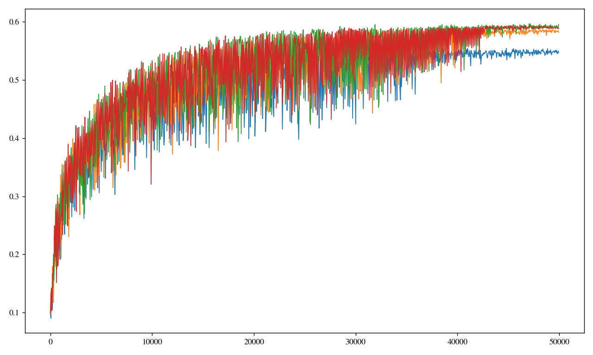
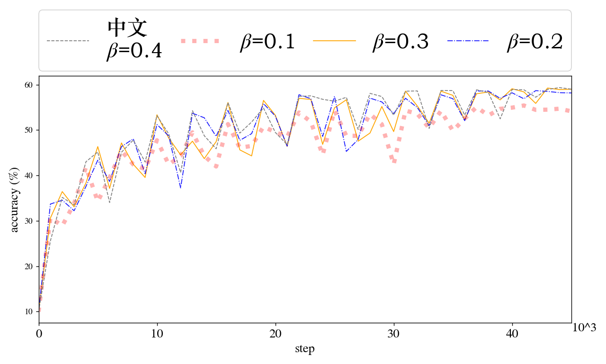
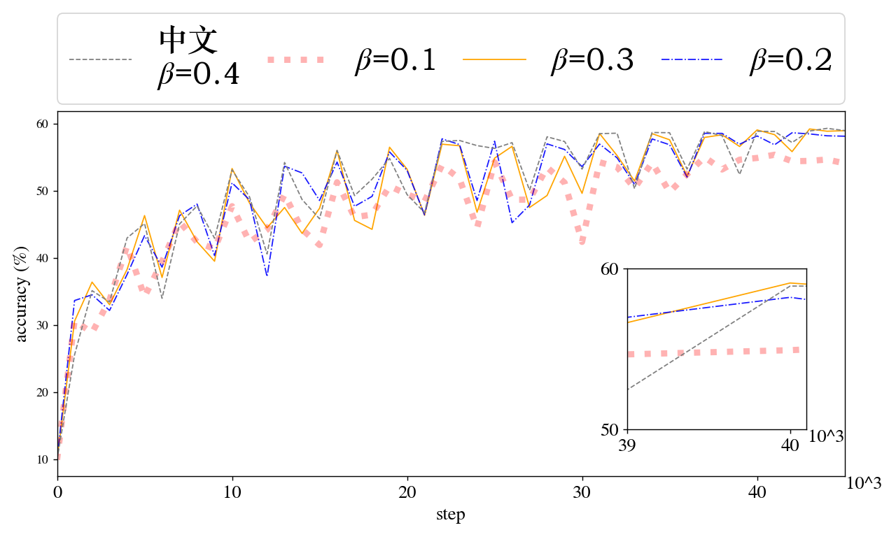

# Matplotlib-Sample
Using matplotlib.pyplot to plot experimental results. 
Code is packed in the module **csv_pic**,
please use the funtion **csv_pic.plot2**. 

# Key Functions
- Draw subfigures within the plot;
- Customize the legends;
- Customize the fonts;
- Customizing the axes.

# Font
The suggested font is TrueType.
1. To set this font, please open anaconda/envs/<env>/lib/site-packages/matplotlib/mpl-data/matplotlibrc.
2. Then add or release the comment "pdf.fontType: 42".
3. Remember to output pdf files rather than eps files in the programs, or errors will be introduced.

# Motivation
Many matplotlib APIs are hard to find, e.g. changing the font, using latex, adding annotation, mixing fonts, adding subfigures, etc.
Since the strict requirements on submissions to conferences in computer science, we actually need these features, but they are not well-documented.
Therefore, I write a sample to record these APIs to avoid searching for them again when we need them.
Using the csv_pic package, we only need to write a config to customize a figure.

# Demo
### vanilla sample using default pars

### customized plotting sample

### sample with subfigure

